# Cyber Threat Intelligence

## Objective

The objective of this lab is to show my threat intelligence skill and assist organizations proactively prevent and mitigate cyberattacks by providing actionable information about potential or existing threats. This involves collecting, analyzing, and sharing data about attackers, their motives, and attack methods to enable proactive defense and improve security posture. 

In this lab, I investigated real-world threats using penCTI and the AlienVault OTX connector, to identify high-risk actors and activities, and report my findings in a way that supports an organization's critical decision-making.

### Skills Learned

- Application of cyber frameworks such as Diamond Model, Kill Chaun and time analysis to understand attacker behavior and impact.
- Cyber Threat Intelligence.
- Starting, stoping and managing docker.

## Components
### Virtualization Platform
- **Microsoft Azure:** Acts as the hypervisor hosting all other virtual machines/servers.

### Threat Intelligence Platform
- **OpenCTI (Open Cyber Threat Intelligence):**
  - An open-source platform I used to manage and share cyber threat intelligence (CTI) in this project.
- **AllienVault Connector :**
  - a software component that i connected to OpenCTI to facilitates data integration and automation between AlienVault's Open Threat Exchange (OTX) OpenCTI.

### Operating System
- **Ubuntu 22.04:**
  -A popular, free and open-source Linux-based operating system. I used this as my server operating System which is used to deplor docker.

### Container
- **Docker:**
  - Docker in simple term is a software platform that allows you to build, test, and deploy applications quickly. In this project, I used docker to deploy openCTI application.

### SSH Client
- **Putty:**
  - I used this to connect with my remote Ubuntu server hosted in Azure.
    
## Configuration Steps

1. **Deploying the Ubuntu Server on Azure:**
   - Deploy an Ubuntu server with the name OpenCTI1 in azure.
     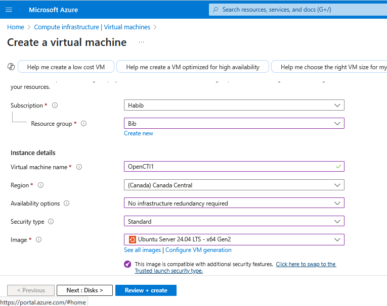
     
   - Setting up inbound firewall rule to allow http traffic on port 8080 to allow me connect to the openCTI application via my web browser. 

    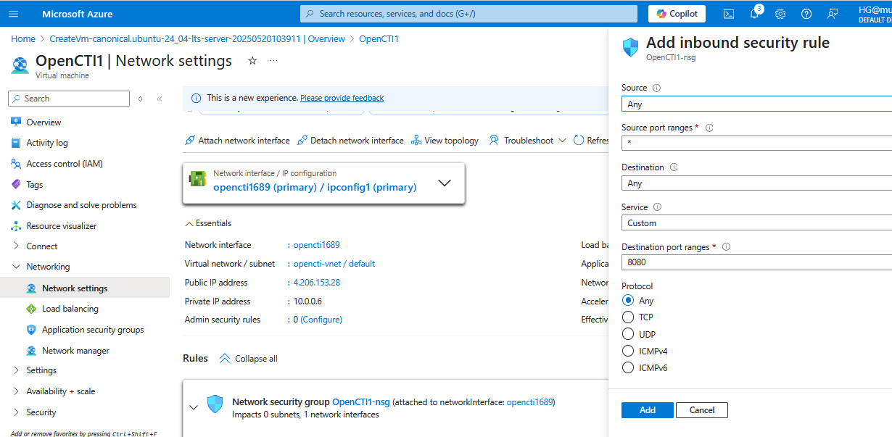

2. **Installation, configuration and deployment of OpenCTI via docker:**
   - Connected to my OpenCTI1 server using putty to perform all installations and configuration.

    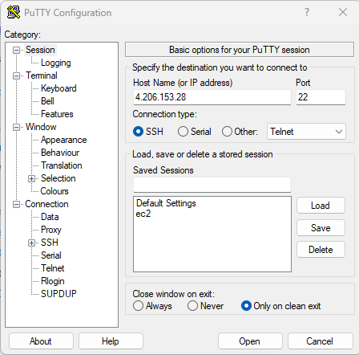
     
   - I downloaded and install the Docker Compose CLI plugin.

    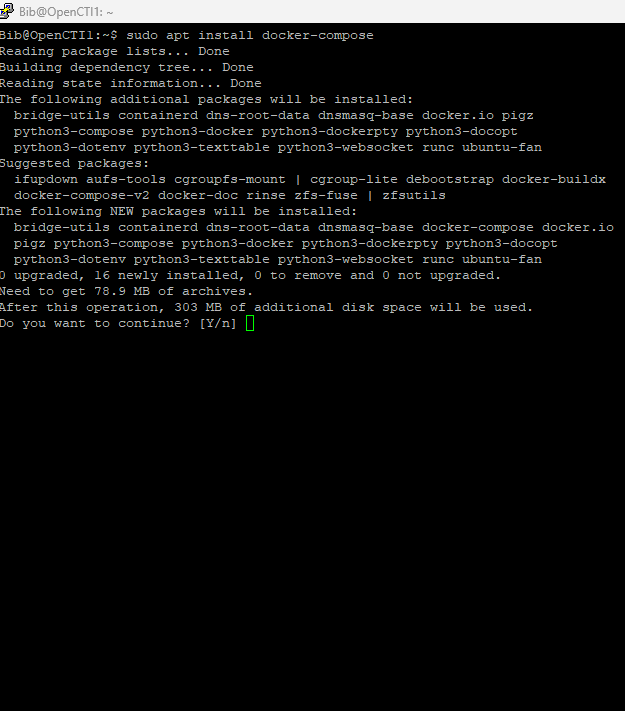

    - Next, I gained root access to my server and navigated to the /opt/ directory where I created a new directory /opencti/, navigated into the opencti directory and cloned this github directory git clone https://github.com/OpenCTI-Platform/docker.git

    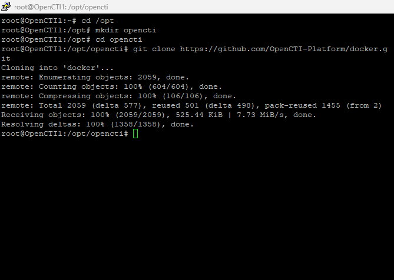
    
   - Configure the environment: I edited the .env file retrieved from cloning the above repository and edited the openCTL admin email and admin password fields to email and password of my preference. I also, set the base url to my Ubuntu server ip address to enable me access my openCTL application and finally generated UUID online to use in the healthcheck access key and admin token field.

    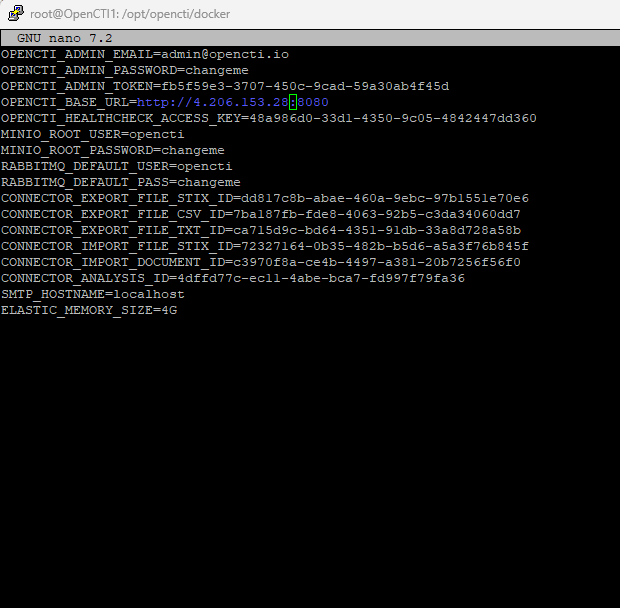

- Next, I started docker service and ran the container in detached mode.

    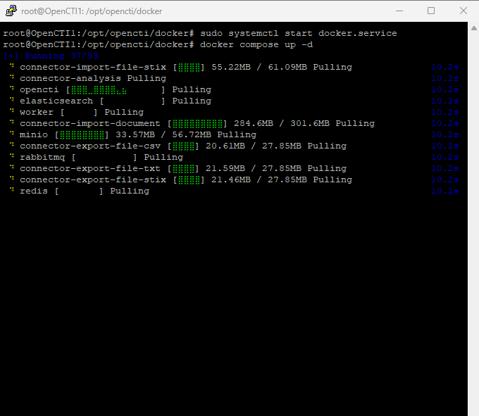
  
   - Finally, I am able to access the OpenCTI application via my web browser using the server ip address on port 8080.
     
     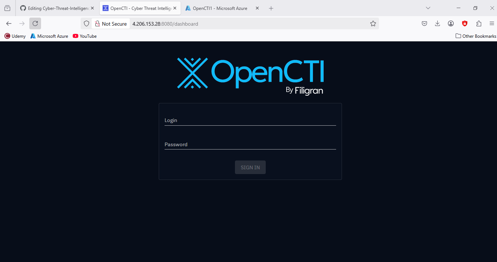
 
    - I proceeded to login using the email address and password I configured in the .env file.
 
       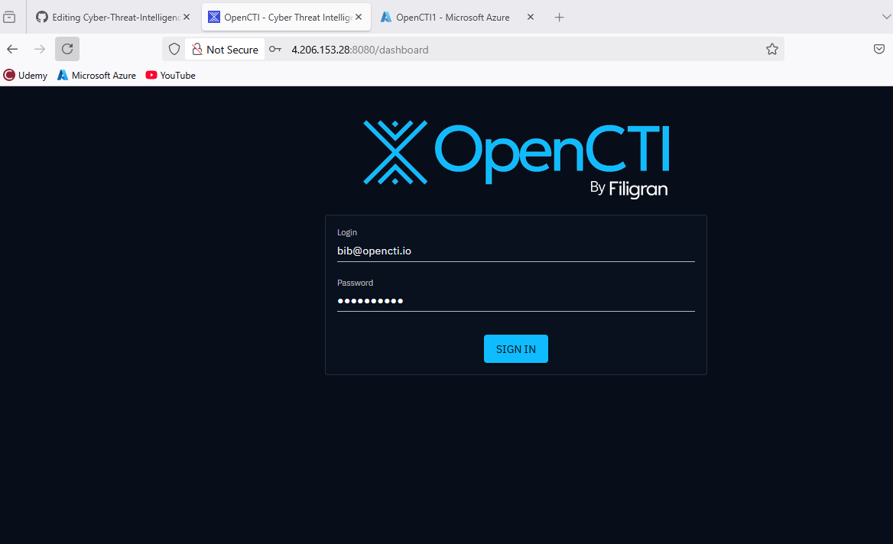
       
       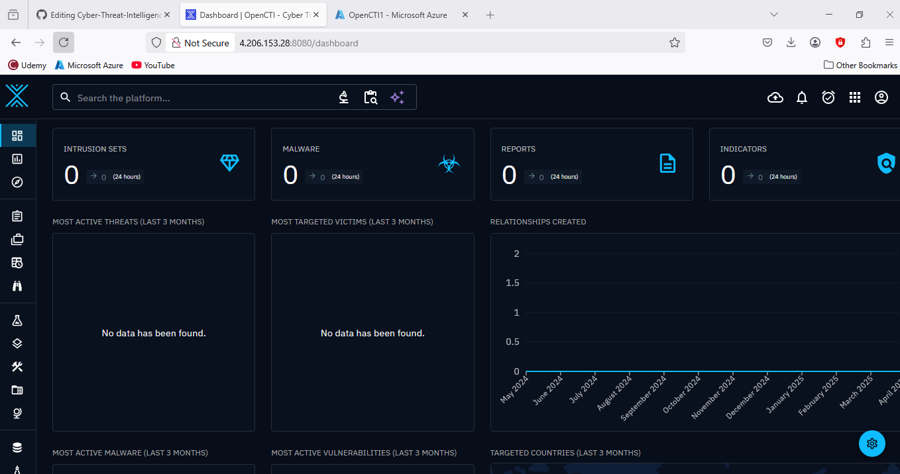

3. **Adding AlienVault Connector to OpenCTI:**
   - I visited the AlienVault webapage here https://otx.alienvault.com to create an account so as to get an API key I will use later in my confiduration.
   - Next, I visited https://github.com/OpenCTI-Platform/connectors to add an external-import AlienVault Connector in OpenCTI
   - Generated a UUID from here https://www.uuidgenerator.net/
   - Opened the docker.compose.yml file in raw from the AlienVault page above and copied the contents.

      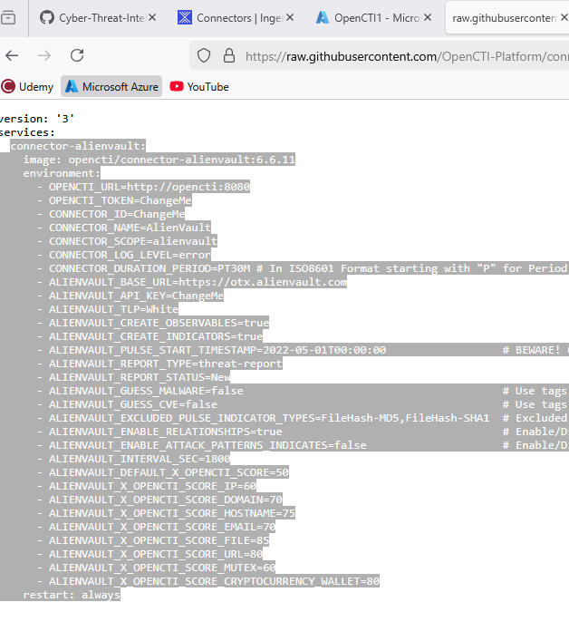

   - I proceeded to paste this content in the docker-compose.yml file in my docker configuration directory.

      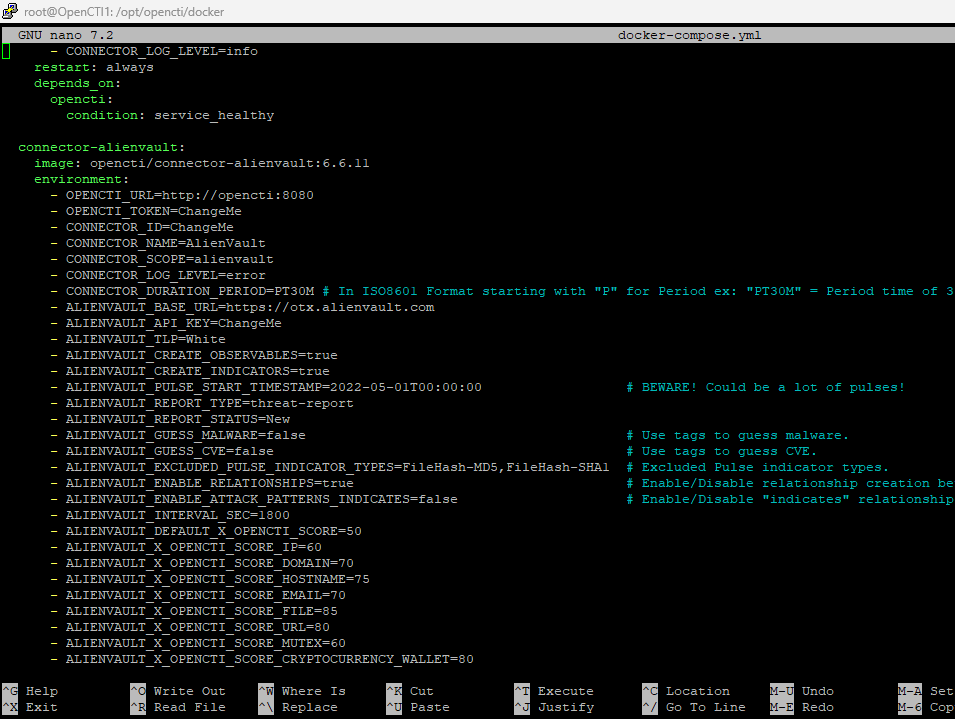

   - I Changed the OPENCTI_URL to my server ip address, OPENCTI_TOKEN to opecnCTI token, CONNECTOR_ID to the UUID i got from the UUID generator page above, and I entered my API key i got after creating an account with AlienVault in the ALIENVAULT_API_KEY.

     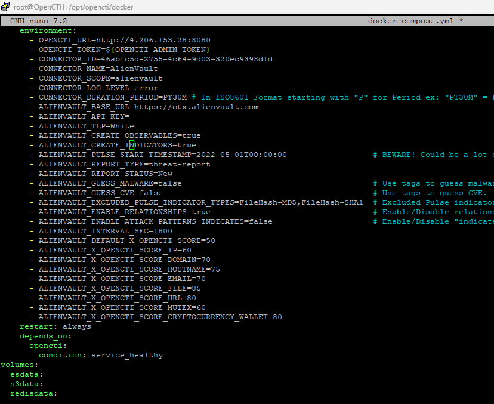
    
   - Next, I updated the docker-compose.yml file and restarted docker.

     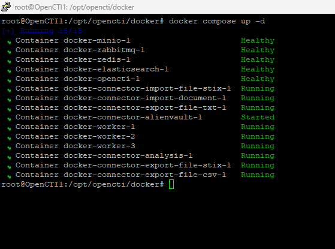

   - Now I waited for some time and after successfully restarting docker, Loged into OpenCTI and went to Data and then the Connectors page,        to verify that AlienVault connector is succesfully added.

       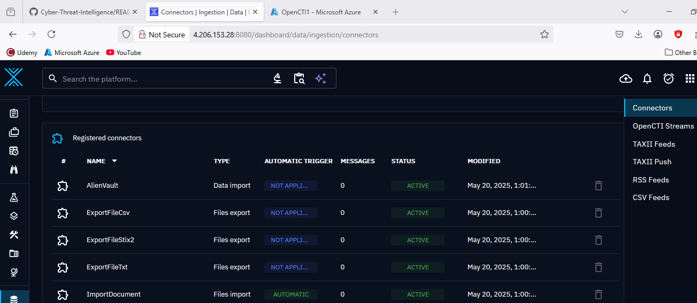
